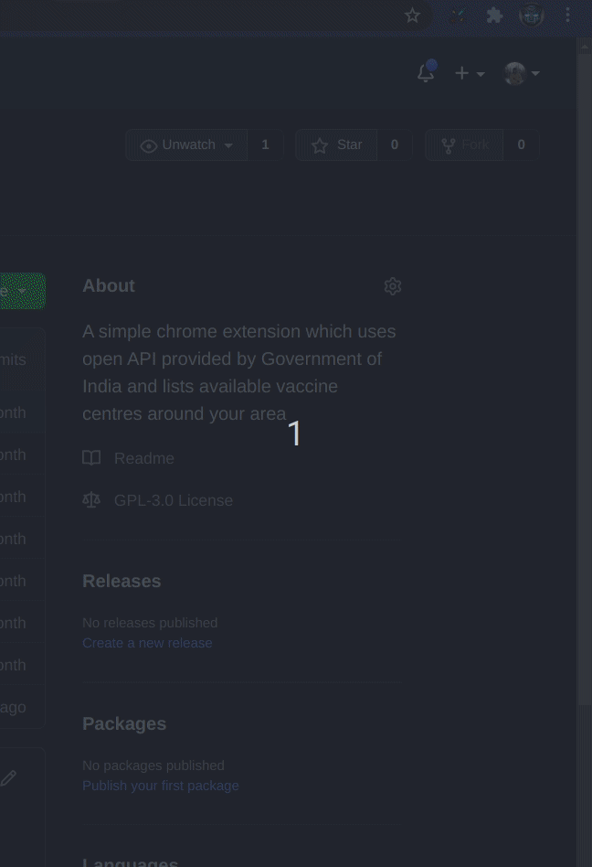

# CowinTracker

A simple chrome extension which uses open API provided by Government of India and lists available vaccine centres around your area

Steps to install extension

1. Clone this Repostiory or download and extract zip file.
2. Go to chrome browser and got to url chrome://extensions/
3. Enable Developer mode on top right corner.
4. Click on Load Unpacked option and select the downloaded directory.
5. Click on chrome extension popup and navigate to Cowin Tracker extension and pin it so that it can be easily accessible.
6. Set up the required configuraiton such as pincode, vaccine name and fee type and save it
7. whenever you'll click on extension, you will get a popup with list of all available vaccine centres

## Extension in action
---

